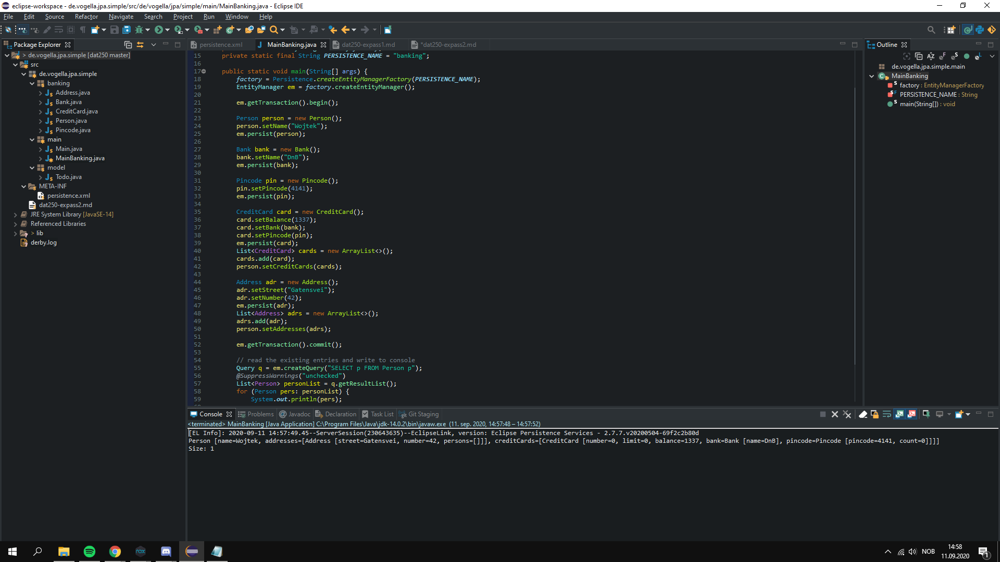

• I had several issues with description of the tutorial. It was poorly described, so understanding what to do and how to do things was the only issue with this experiment. That being said, the issue with what .jar files had to be included in this project, since not only the names were different from tutorial, but also the functionality. This meant that i had to use more specified .jar files and it worked just fine.

• Link to my expass2 code in both experiments: https://github.com/wpa001/dat250/tree/master/expass2

• 

• No further issues at this time :)