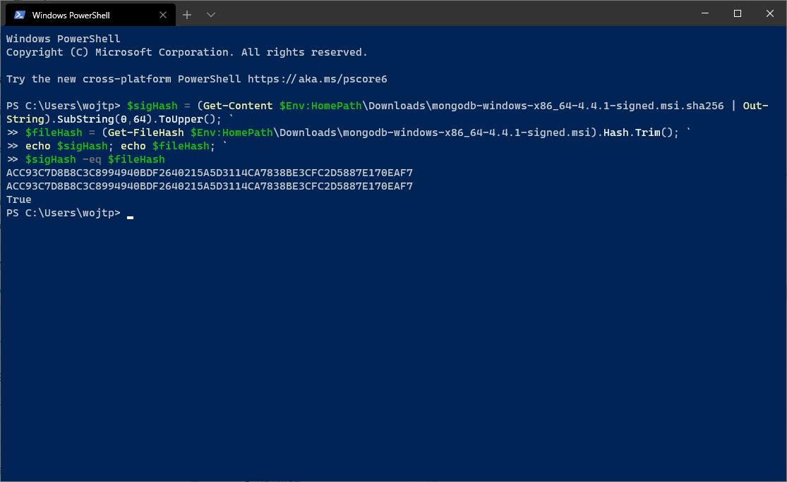
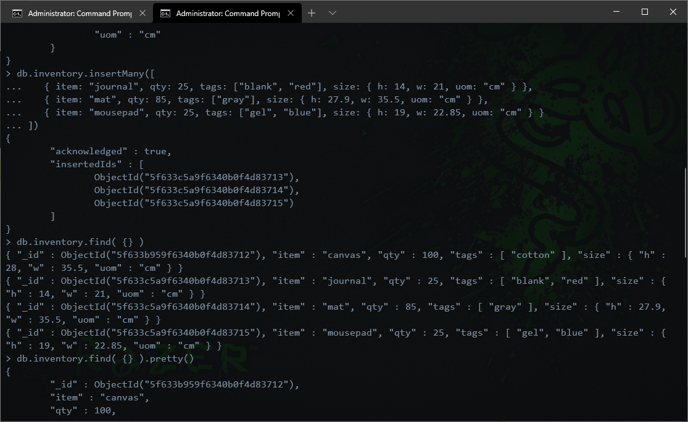
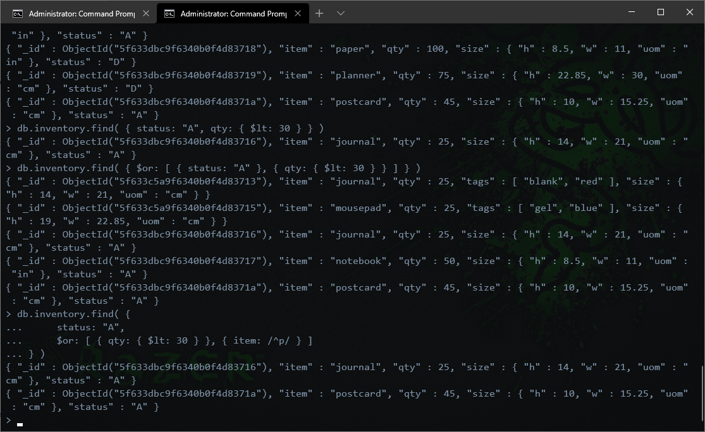
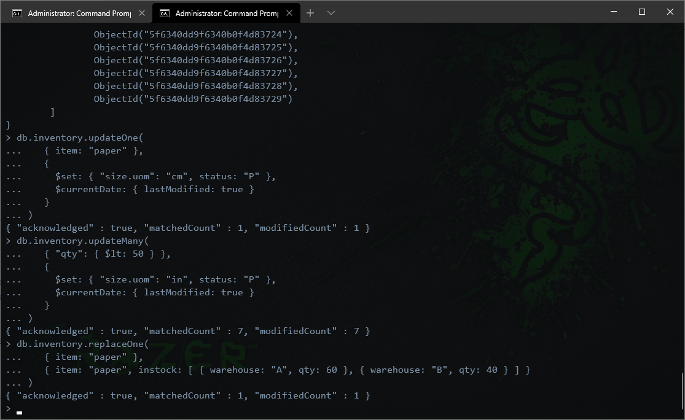
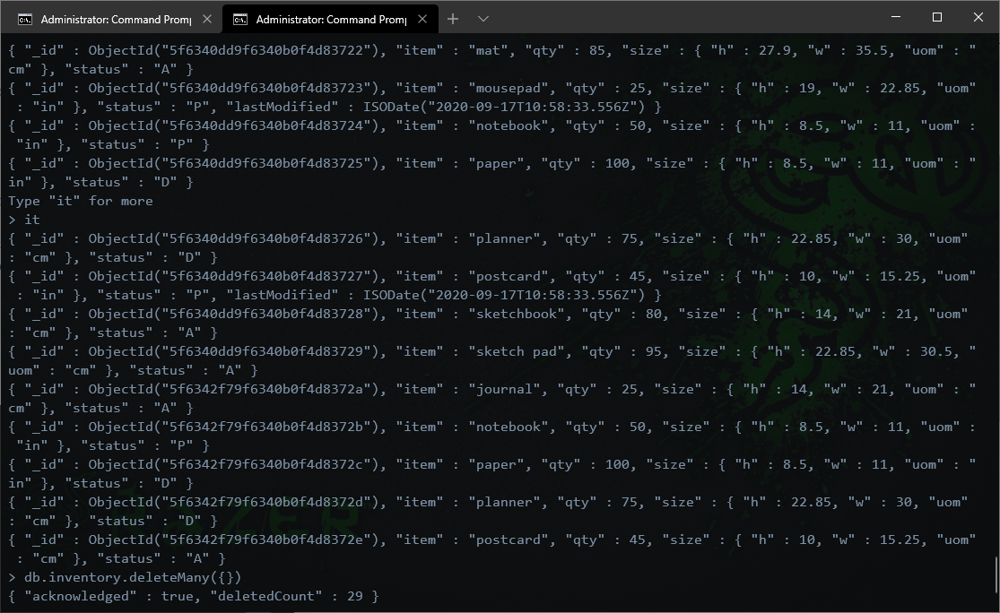
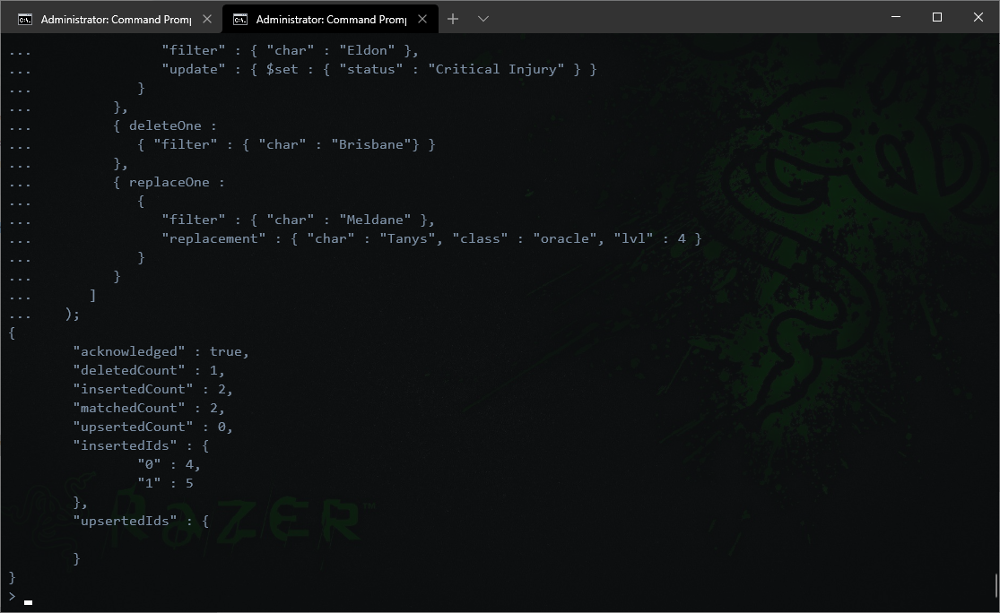
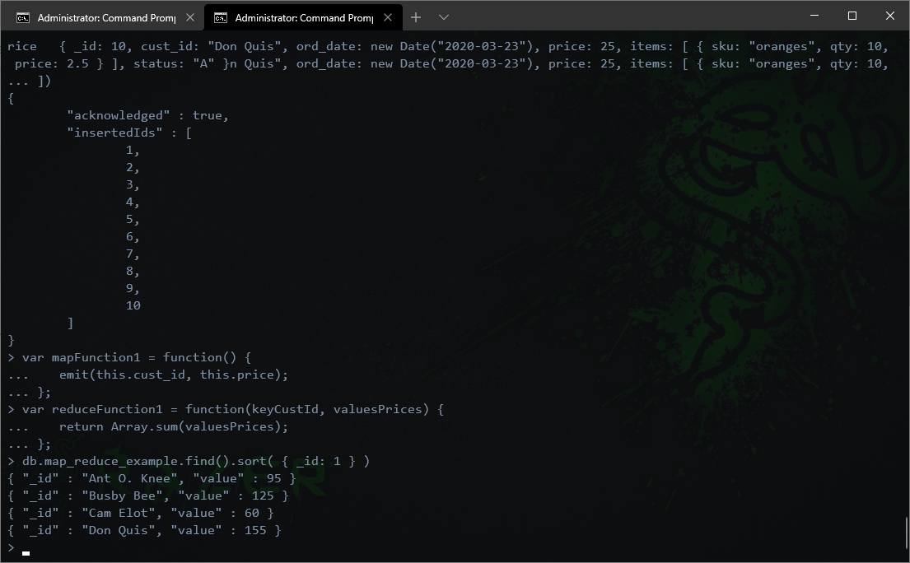
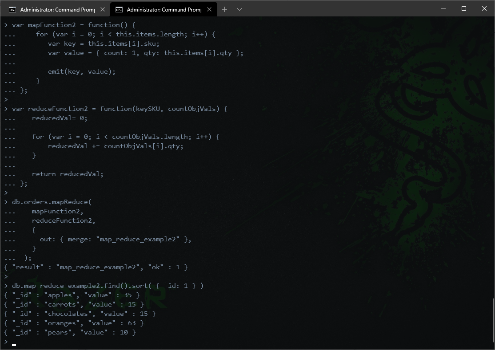

• No errors or problems wile downloading MongoDB. Everything not only went fast but also smoothly :)

## Validation of the installation package


## Experiment 1 (CRUD Operantions)
##### • Insert Documents:


##### • Query Documents:


##### • Update Documents:


##### • Remove Documents:


##### • Bulk Write Operation:



## Experiment 2 (Aggregation)

##### • Example given to test:


##### • Own created mapReduce:
    

```
Reasoining behind this mapReduce is how usefull it is to know how much of one product has been sold. And where the revenue is coming from.
```

• No further pending issues, all has been done and executed as intended :)